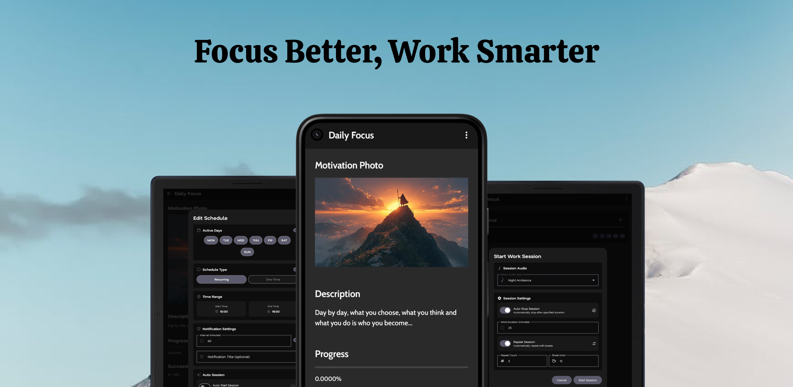

# Stay Focused with a Smarter Pomodoro Timer

This app takes the Pomodoro technique to the next level with features designed for real productivity. Whether you just want a simple timer or advanced goal tracking, it adapts to your workflow.

## Unique Features:

**Auto-Start Sessions**: Set sessions to begin automatically (e.g. every 30 minutes) with a sound cue. No hesitation, no wasted time—just instant focus.

**Visual Motivation**: Replace boring text notifications with powerful images. After all, a picture is worth a thousand words.

**Custom Session Sounds**: Choose nature sounds or play your own audio for maximum concentration. Everyone works differently, so your soundscape should match your style.

## Core Features:

**Goal Tracking by Time Worked**: Your progress updates automatically as you complete sessions, but you can also add to it manually.

**Flexible Pomodoro Cycles**: Customize work and break lengths to fit your rhythm, not someone else’s.

## Premium Support
All core features are free. Unlock premium themes with a one-time purchase to personalize your focus space and support further development.

You can make feature requests and report bugs from the Issues section.

